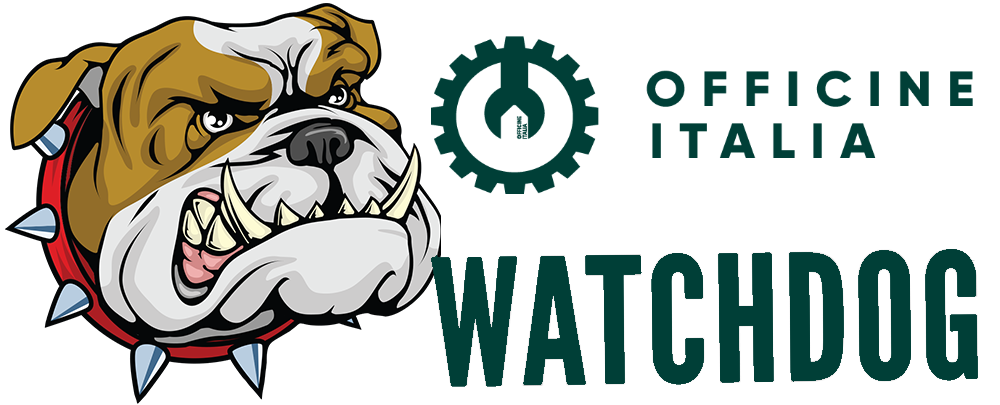

<!-- README.md è generato da README.Rmd. Per favore modifica quello e compila il documento  -->

# Text Mining Officine Italia per i **Giovani**

*author*: **[Nicolò Foppiani](https://github.com/nfoppiani)**  
*author*: **[Niccolò Salvini](https://niccolosalvini.netlify.app/)**
  *last build date*: 20 marzo, 2021

   

## Descrizione:

L’Europa potrebbe oggi recuperare la **credibilità** e la **visione** di
cui per anni si è lamentata la mancanza. L’intero programma Next
Generation EU risulta dunque un’opportunità unica per una vera catarsi
dell’Unione Europea, per tracciare una **traiettoria** radicalmente
nuova di **valorizzazione** delle **diversità** e di **solidarietà**,
non un pallido riflesso di slogan ripetuti a non finire da politici
nazionali e non.

Nasce così **NGW – Next Generation Watchdog,** l’osservatorio di giovani
per i giovani che valuterà e monitorerà nei mesi e anni a venire la
credibilità e solidità delle proposte presentate dagli Stati Membri per
l’utilizzo delle risorse comuni. Lo farà però in una chiave di lettura
ben precisa: una chiave generazionale.

### Come?

**NGW** sta sviluppando un algoritmo di **analisi** **semantica** e del
linguaggio per poter standardizzare la valutazione di tutti i progetti
presentati in base al contenuto che questi presentano e organizzarli in
modo tale che possano essere comparati e rilevati gli aspetti salienti,
nonchè la presenza dei **Giovani**

### Chi?

Siamo **Under 30** che vogliono far sentire la propria voce forte e
chiara, lo abbiamo fatto con diverse iniziative finora e **NGW** è un
esempio cruciale di cosa voglia dire per noi essere cittadini attivi.

### Perchè?

Le risorse che investiamo oggi non possono mancare di un progetto
**strategico** **condiviso** e di una visione d’insieme, non solo a
livello nazionale ma **europeo**. Lo vogliamo fare chiedendo ascolto e
confronto, per contribuire a interrogarci su come disegnare l’Italia e
l’Europa del futuro

## Uso ✋:

### Applicazioni Minimali

-   app 1: esplorare i **Trigrammi**:
    [deploy](https://niccolosalvini.shinyapps.io/app_1/)
-   app 2: esplorare i **Topics**:
    [deploy](https://niccolosalvini.shinyapps.io/app_2/)
-   app 3: network di **Bigrammi**:
    [deploy](https://niccolosalvini.shinyapps.io/app_3/)

Clona la repo in locale col comando

`$ git clone https://github.com/NiccoloSalvini/textmining_OI.git`

Apri il file di progetto nella cartella clonata `textmining_OI.Rproj`,
successivamente compila il documento `main.R` col comando **knit**
direttamente dall’editor, o in alternativa
`rmarkdown::render("main.Rmd")`

## To-Do / To-Be-Doing ⌛:

-   [ ] build the front-end [Figma](https://www.figma.com/) + gatsby/
    react.js
-   [x] creating *trigrams* Giovani - non Giovani
-   [x] build **wordclouds**
-   [ ] obtain all **PNRs**
-   [x] build minimal shiny app to explore trigram
-   [x] build minimal topic modelling app (failed)
-   [x] build minimal network eploration app
-   [x] style the CSS for mobile usage and for more confortable usage
-   [ ] deal with the BERT expert
-   [x] connect to db (Dropbox)
-   [ ] test performance with
    [Profvis](https://rstudio.github.io/profvis/)

## Code of Conduct 📰

Contributor Code of Conduct As contributors and maintainers of this
project, we pledge to respect all people who contribute through
reporting issues, posting feature requests, updating documentation,
submitting pull requests or patches, and other activities.

We are committed to making participation in this project a
harassment-free experience for everyone, regardless of level of
experience, gender, gender identity and expression, sexual orientation,
disability, personal appearance, body size, race, ethnicity, age, or
religion.

Examples of unacceptable behavior by participants include the use of
sexual language or imagery, derogatory comments or personal attacks,
trolling, public or private harassment, insults, or other unprofessional
conduct.

Project maintainers have the right and responsibility to remove, edit,
or reject comments, commits, code, wiki edits, issues, and other
contributions that are not aligned to this Code of Conduct. Project
maintainers who do not follow the Code of Conduct may be removed from
the project team.

Instances of abusive, harassing, or otherwise unacceptable behavior may
be reported by opening an issue or contacting one or more of the project
maintainers.

This Code of Conduct is adapted from the Contributor Covenant
(<http:contributor-covenant.org>), version 1.0.0, available at
<http://contributor-covenant.org/version/1/0/0/>

<!-- ## References -->
